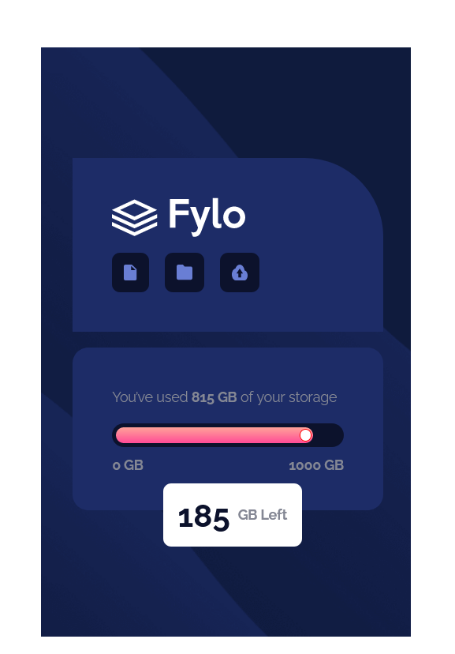
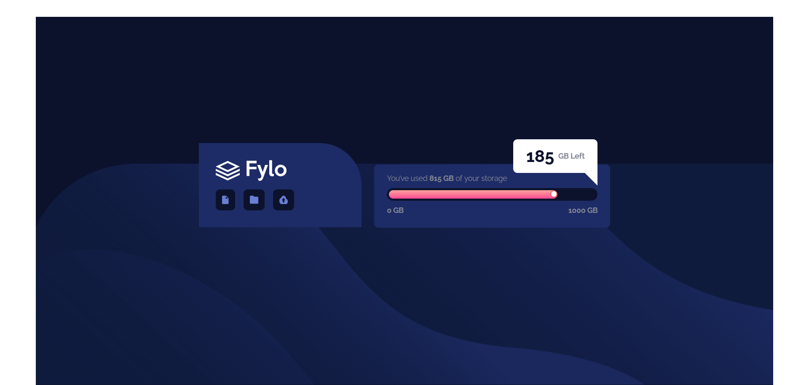

# Frontend Mentor - Fylo data storage component solution

This is a solution to the [Fylo data storage component challenge on Frontend Mentor](https://www.frontendmentor.io/challenges/fylo-data-storage-component-1dZPRbV5n). Frontend Mentor challenges help you improve your coding skills by building realistic projects. 

## Table of contents

- [Overview](#overview)
  - [The challenge](#the-challenge)
  - [Screenshot](#screenshot)
  - [Links](#links)
- [My process](#my-process)
  - [Built with](#built-with)
  - [What I learned](#what-i-learned)
  - [Continued development](#continued-development)
  - [Useful resources](#useful-resources)
- [Author](#author)
- [Acknowledgments](#acknowledgments)

### Screenshot

### Links

- Solution URL: [My Solution](https://github.com/shashikantdev3/FrontendMentor-fylo-data-storage-component-master)
- Live Site URL: [Live Preview](https://shashikantdev3.github.io/FrontendMentor-fylo-data-storage-component-master/)

## My process

### Built with

- Semantic HTML5 markup
- CSS custom properties
- Flexbox
- CSS Grid
- Mobile-first workflow

## Author

- Website - [Shashikant Dev](https://www.your-site.com)
- Frontend Mentor - [@shashikantdev3](https://www.frontendmentor.io/profile/shashikantdev3)
- Twitter - [@shashikantdev3](https://www.twitter.com/shashikantdev3)
